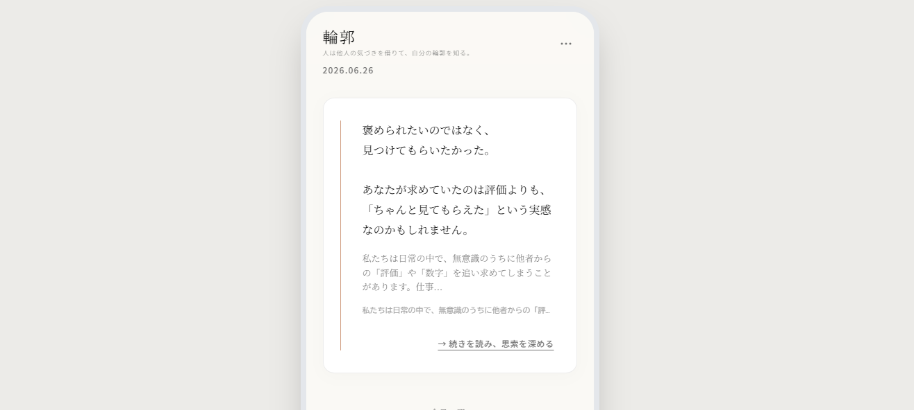

# 輪郭



**「他者の視点から、自分の輪郭を知る。」**

「輪郭」は、他者からの観察やAIとの対話を通して、自分自身を見つめ直す自己探求アプリです。
日々の問いへの回答や他者から寄せられた言葉をもとに、自分では気づきにくい価値観や個性を整理し、新たな気づきを得られる体験を目指して制作しました。

---

## 制作目的

* 自己理解を深めるWebサービスの企画・制作
* UI/UX設計とフロントエンド開発の学習
* AIを活用した自己分析サービスの設計

## ターゲット

* 自分自身を客観的に知りたい方
* 日記や内省を習慣にしている方
* AIとの対話を通して自己理解を深めたい方

## 使用技術

* HTML5
* Tailwind CSS
* JavaScript
* Gemini API（設計・実装想定）

## 主な機能

* 今日の問いへの回答
* AIによる輪郭カード生成
* 他者からの観察機能
* 気づきライブラリ
* AIエッセイ（内省エッセイ）生成

## 工夫したポイント

* 白を基調とした落ち着きのあるデザインで、内省しやすい雰囲気を演出
* 「SNS」ではなく「自己理解」を目的としたUI設計
* AIを主役ではなく、ユーザーの思考を整理するサポート役として設計
* カード形式を採用し、情報量が多くても読みやすいレイアウトを意識
* 他者からの観察を安心して受け取れるよう、やわらかい表現や導線を設計

## ディレクトリ構成

```
rinkaku/
├── img/
├── index.html
└── README.md
```

## 公開ページ

https://pluto007-lab.github.io/rinkaku/

## 学んだこと

* サービスコンセプトからUI設計まで一貫して考える経験
* Tailwind CSSを活用したデザイン制作
* AIを活用したWebサービス設計の考え方
* GitHub Pagesを利用したWebサイト公開

## 今後改善したい点

* Gemini APIとの連携によるAI機能の実装
* ユーザー認証・データ保存機能の追加
* 他者からの観察機能の実装
* レスポンシブ対応やアクセシビリティのさらなる改善

## 制作

職業訓練校での個人制作として企画・制作。
サービスコンセプトの立案からUI設計、フロントエンド実装まで担当しました。
